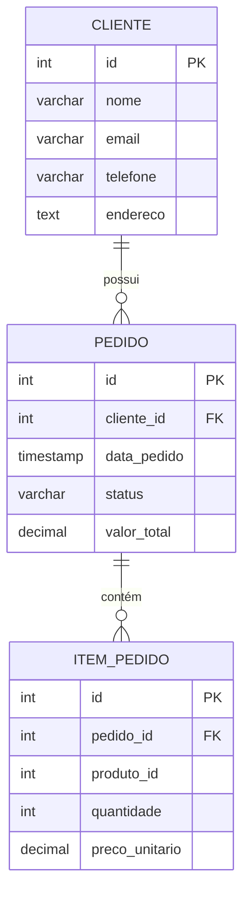

```mermaid
erDiagram
    CLIENTE {
        int id PK
        varchar nome
        varchar email
        varchar telefone
        text endereco
    }
    
    PEDIDO {
        int id PK
        int cliente_id FK
        timestamp data_pedido
        varchar status
        decimal valor_total
    }
    
    ITEM_PEDIDO {
        int id PK
        int pedido_id FK
        int produto_id
        int quantidade
        decimal preco_unitario
    }
    
    CLIENTE ||--o{ PEDIDO: "possui"
    PEDIDO ||--o{ ITEM_PEDIDO: "contém"
```